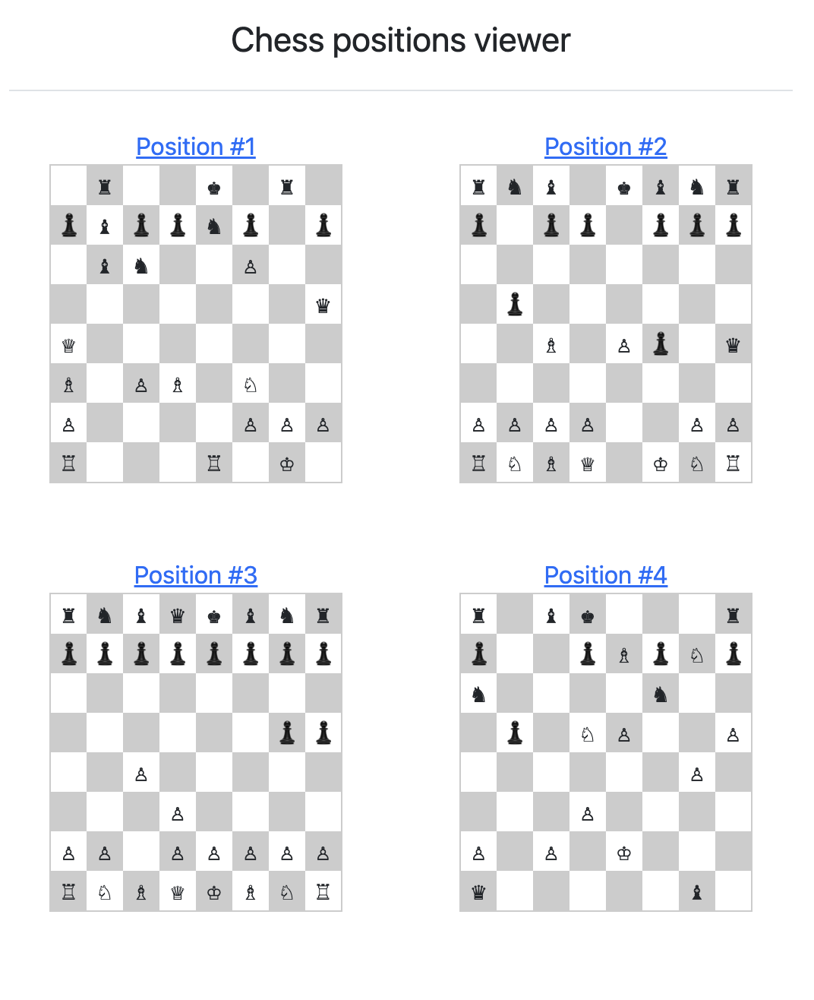
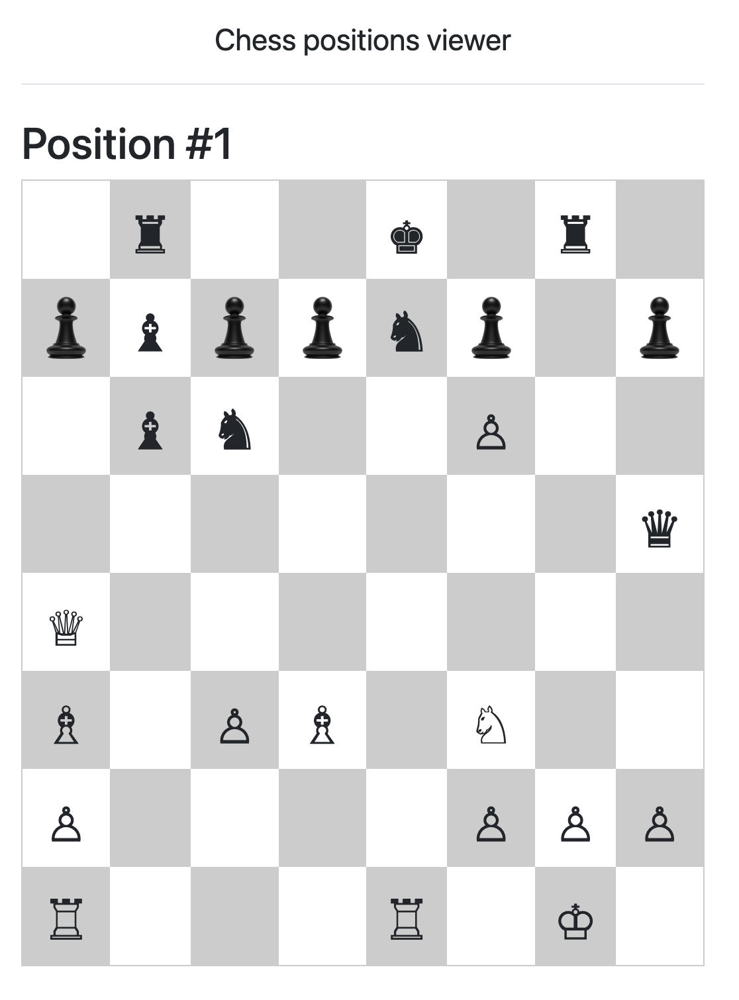

# chess_mvc

Simple Chess positions project on self-written MVC framework.

Use wikipedia syntax for store board and figures. For display using unicode symbols

| List positions | One position view |
|--|--|
|  |  |

## Install

```bash
git clone https://github.com/denisoid/chess_mvc.git

cd chess_mvc\

composer install

mysql -uroot -p -e 'CREATE DATABASE chess'
mysql -uroot -p chess < dump.sql

```
